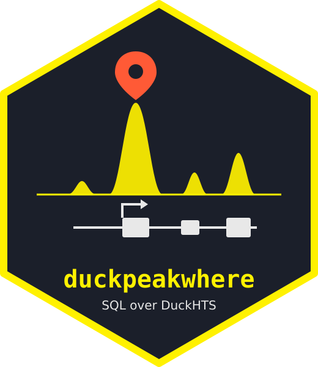

<!-- README.md is generated from README.Rmd with `make readme`. Please edit that file. -->

# duckpeakwhere 

[](https://github.com/sounkou-bioinfo/duckpeakwhere/actions/workflows/test.yml)
[](https://github.com/sounkou-bioinfo/duckpeakwhere/actions/workflows/pages.yml)

**Where do your peaks land?** Split ChIP-seq, CUT&RUN and ATAC-seq peaks
into promoter, 5′ UTR, 3′ UTR, exon, intron and intergenic space, with a
genome background bar, in the browser.

This is a port of [peakwhere](https://github.com/seandavi/peakwhere) by
Sean Davis. It keeps peakwhere’s biological rules and its hand-worked
test fixture, but replaces its hand-written GFF3/GTF parser and planned
overlap engine with SQL over
[DuckHTS](https://github.com/RGenomicsETL/duckhts) running in
[duckdb-wasm](https://github.com/duckdb/duckdb-wasm).

**Try it: <https://sounkou-bioinfo.github.io/duckpeakwhere/>**.
Everything runs in your browser, and the page makes no requests outside
its own origin.

The same page offers **Peek**, a BED-family sanity check based on Sean
Davis’s [PeakPeek](https://github.com/seandavi/peakpeek): widths,
coverage, chromosomes, duplicates and problems, with no annotation
required. Switch **View** between **Where** and **Peek**; both share the
file selection, database and local-file transport.

## How it works

Where is in [`src/annotate.js`](src/annotate.js), one SQL statement per
step:

| Step                                        | peakwhere                     | here                                                                     |
|---------------------------------------------|-------------------------------|--------------------------------------------------------------------------|
| Read GFF3 / GTF / BED                       | hand-written streaming parser | `read_gff`, `read_gtf`, `read_bed` (htslib)                              |
| Chromosome names (`chr1` = `1`, `M` = `MT`) | JavaScript                    | `duckhts_contig_key`                                                     |
| Transcripts, UTRs, promoter windows         | JavaScript model              | plain SQL over the feature table                                         |
| Priority partition                          | planned sorted-segment engine | cut points in SQL; each segment’s category from a DuckHTS cgranges index |
| Peak centres, base pairs, genome background | binary search per peak        | `duckhts_cgranges_overlaps_list` against the partition                   |

The rules are peakwhere’s:

- Promoter is ±1 kb around the TSS base, counted on the strand.
- Priority is Promoter \> 5′ UTR \> 3′ UTR \> Exon \> Intron \>
  Intergenic.
- One count per peak centre, or per base pair.
- Unmatched chromosomes are reported, and a file with more than 5%
  unmatched peaks is not drawn.
- The genome background comes from GFF3 `##sequence-region` lengths.

The page makes no requests outside its own origin. duckdb-wasm,
Observable Plot and the DuckHTS builds are served from `vendor/`. The
default build is community-signed and loads with unsigned extensions
disallowed.

## Peek

Choose **Peek**, select peak files, and click **Peek at peaks**. The
summary includes valid peak count; minimum, median, mean and maximum
widths; sum of widths; merged bp; chromosome count/style; off-main,
duplicate, overlapping and \>100 kb counts; and excluded returned rows.
Problems state their counts. Expand each file for its five smallest and
largest peaks. Compare files with shared log-width bins and chromosome
charts, in counts or percentages. Download the summary as TSV and either
chart as SVG.

[`src/peek.js`](src/peek.js) reads inputs with `read_bed`, validates
returned coordinates in SQL, and reduces them in DuckDB. An index keyed
by file and **original** chromosome name supplies
`duckhts_cgranges_count_overlaps` for overlap counts and
`duckhts_cgranges_has_overlap` for disjoint endpoint-span membership;
summing covered spans gives merged bp. SQL supplies medians, means,
duplicates, bins and grouping. `duckhts_contig_key` aligns chart aliases
without changing raw-name statistics.
[`src/peek-view.js`](src/peek-view.js) only displays results. There is
no JavaScript parser, interval algorithm, sampling or annotation
dependency.

### Shared peak-file rules

Both views use [`src/peaks.js`](src/peaks.js): one `read_bed` scan per
file into `peak(fid, label, raw_chrom, ckey, s, e, name, reason)`. Only
rows without a rejection reason reach either analysis. Errors are per
file; a failed read contributes no rows and does not prevent other files
from being analysed. Both views report the same rejected counts and
reasons.

These rules match upstream behaviour: peakwhere at `f40a673` (its
`src/peaks.js` and tests) and PeakPeek at `a05b661` (its `src/stats.js`,
`examples/fixture.js` and `tests/stats.test.js`). Where the two differ,
the choice is stated here:

- BED coordinates are 0-based, half-open. Reject missing/non-integer
  coordinates, negative coordinates, end before start, and zero width.
  Both upstreams reject these; the distinct reason names follow
  PeakPeek. Duplicates are retained in both views.
- Trim chromosome names for analysis; retain the reader’s original
  spelling in `raw_chrom`. Where matches contigs through
  `duckhts_contig_key`, as do Peek’s aligned charts. Peek’s per-file
  statistics preserve the trimmed spelling, so `chr1` and `1` remain
  distinct there, as in PeakPeek.
- Coordinates must fit cgranges’ signed 32-bit range
  (`end ≤ 2147483647`); larger rows are rejected in both views, even
  though upstream JavaScript permits larger integers.
- DuckHTS supplies BED-family parsing. Whole-number scientific notation
  accepted by upstream peakwhere is rejected here because `read_bed`
  returns NULL. A row with fewer than three fields fails its entire
  file, rather than producing upstream’s per-line rejection. CSV/TSV
  header mapping, raw-line diagnostics and decimal optional fields await
  [DuckHTS \#250](https://github.com/RGenomicsETL/duckhts/issues/250).
  We do not implement a second parser. Known-limit tests pin these
  boundaries.

[`src/session.js`](src/session.js) owns the cached tables on one
connection. Annotation header metadata, the `feature`, `part` and `tx`
tables, and the annotation’s distinct contig set are loaded once per
selected annotation. A centre/bp switch only counts against the retained
cgranges partition; promoter or protein-coding changes rebuild
categories and the partition, without file I/O. Base-pair counting
probes cgranges once per accepted, matched peak, then reduces its
overlap list into the five genic categories; intergenic is the remaining
width. No lateral expansion of peak/segment pairs is needed. Peak
selections retain unchanged files and read only additions/replacements.
Switching views reuses the same peak table. File identity is its session
URL and label; a failed file’s error is cached until that selection is
removed or replaced. Clearing files drops the tables and destroys the
cached index. Remote URLs are treated as immutable during the session.

W2 centre counts are checked against the committed upstream peakwhere
CSV and our head-to-head receipt on every timing run. PeakPeek
statistics are checked only against its own hand-worked fixture and
full-file SPEC expectations.

## PeakPeek compatibility

The reference is PeakPeek commit
[`a05b661`](https://github.com/seandavi/peakpeek/tree/a05b6615b1c51c41781b6a1f2081868fbc2b711e),
its code, tests and hand-worked fixture. This is a BED-family statistics
port, not a replacement for PeakPeek’s complete input parser.

| Rule                                                                                | Status here                                                                                                                                                                                                                                                             |
|-------------------------------------------------------------------------------------|-------------------------------------------------------------------------------------------------------------------------------------------------------------------------------------------------------------------------------------------------------------------------|
| 0-based half-open BED/narrowPeak/broadPeak, gzip                                    | Kept for tab-delimited inputs read by DuckHTS.                                                                                                                                                                                                                          |
| Zero width, negative/reversed/missing coordinates                                   | Excluded from returned rows with a count by reason.                                                                                                                                                                                                                     |
| Min/median/mean/max/sum; even median averages two middle widths                     | Kept. UI means show up to two decimals; TSV keeps the numeric result.                                                                                                                                                                                                   |
| Coordinate-only duplicates                                                          | Kept: count extra copies, ignoring name/score, without dropping them.                                                                                                                                                                                                   |
| Merged bp and overlapping peaks                                                     | Kept: touching joins coverage but does not count as overlap; each duplicate copy overlaps.                                                                                                                                                                              |
| Chromosomes                                                                         | Kept: statistics distinguish original names; chart aliases align; numbered/X/Y/M/MT are main, others group as `other`.                                                                                                                                                  |
| Distribution                                                                        | Kept: 30 shared log-spaced bins, last edge inclusive; equal widths expand the upper bound by 1; counts/percentages; no sampling.                                                                                                                                        |
| Problems                                                                            | Kept for returned intervals: duplicate/overlap/off-main/mixed-style counts and strictly \>100 kb. Failed files show an error while other files remain usable.                                                                                                           |
| CSV/TSV named-column tables and the 1-based toggle                                  | Not ported: outside `read_bed`’s contract.                                                                                                                                                                                                                              |
| Scientific-notation coordinates and tolerant malformed-row parsing                  | Not ported: DuckHTS returns NULL for scientific notation and aborts on short rows. It cannot reproduce PeakPeek’s rejected-line recovery.                                                                                                                               |
| Raw lines, skipped-line counts, exact format detection, rejection line numbers/text | Not available from `read_bed`; the UI says **excluded rows**, never invented line counts or diagnostics.                                                                                                                                                                |
| narrowPeak signal/p/q ranges and raw record previews                                | Not ported: `read_bed` exposes BED12 fields, so decimal columns 7/8 are NULL and extra fields are not retained. Extremes show parsed coordinates/name only.                                                                                                             |
| Coordinates above 2,147,483,647                                                     | Excluded with an explicit reason: cgranges has an int32 coordinate limit.                                                                                                                                                                                               |
| UI/delivery                                                                         | Uses vendored Observable Plot, explicit Run, selected filenames/bundled labels, same-origin examples and local files. Editable extension-stripped labels, URL fetching and per-file removal are not ported. The large-file warning counts returned rows, not raw lines. |

These reader gaps cannot be repaired by statistics SQL because the
necessary raw values are not exposed. Limitation tests pin the behavior
to prompt review when DuckHTS adds those APIs; see its [`read_bed`
implementation](https://github.com/RGenomicsETL/duckhts/blob/41d5e899b3d2771a47c130ee003a49ddb4a2c4e2/src/interval_udf.c)
and the [browser-reader
issue](https://github.com/RGenomicsETL/duckhts/issues/246). No
JavaScript parser substitutes for it. Dedicated upstream
parsing/diagnostic requests are still needed; \#246 concerns transport,
not these semantic gaps.

### Whole-genome thymus examples

Where’s existing files are chr19 subsets. PeakPeek’s published answers
are for the full ENCODE accessions. Stage the **whole-genome Peek**
dataset (about 3.9 MB compressed) and select it in Peek:

``` bash
npm run stage:peek
# Offline, with archived full files:
npm run stage:peek -- /path/to/W2
```

The script reuses URLs and SHA-256 pins in `bench/manifest.json` and
writes generated files under `vendor/peek-examples/`. At runtime they
load only from this site’s origin. Switching back to Where from this
Peek-only dataset selects the chr19 examples. Both signed and dev
browser tests compare **all five files** to PeakPeek `SPEC.md` §2:
including CTCF’s 20,220 peaks, one duplicate and 6,003,019 merged bp,
and DNase’s 67,929 peaks and 14,146,163 merged bp. The hand-worked
fixture and rule tests cover nesting, touching, duplicate identity,
invalid returned coordinates and mixed names.
[`test/fixtures/peek/README.md`](test/fixtures/peek/README.md) records
oracle provenance. PeakPeek’s malformed fixture is tested as a reader
limitation, not quietly accepted as a parser-equivalence test.

## The same SQL, outside the browser

Nothing in the SQL is browser-specific. These chunks run in the DuckDB
CLI against the bundled example data, with the same DuckHTS extension.

The files are read whole, so the readers use
`scan_mode := 'sequential'`, which streams without looking for a tabix
index. Here is the annotation as `read_gff` sees it:

``` sql
SELECT feature, count(*) AS n
FROM read_gff('examples/gencode.vM25.basic.chr19.gff3.gz', scan_mode := 'sequential')
GROUP BY feature
ORDER BY n DESC, feature
LIMIT 6;
#> ┌─────────────────┬───────┐
#> │     feature     │   n   │
#> │     varchar     │ int64 │
#> ├─────────────────┼───────┤
#> │ exon            │ 17082 │
#> │ CDS             │ 14404 │
#> │ five_prime_UTR  │  2429 │
#> │ transcript      │  2303 │
#> │ three_prime_UTR │  1577 │
#> │ start_codon     │  1553 │
#> └─────────────────┴───────┘
```

The peak files, read by `read_bed` straight from gzip:

``` sql
SELECT 'CTCF' AS mark, count(*) AS peaks, median("end" - start) AS median_width
FROM read_bed('examples/thymus_CTCF_ENCFF714WDP.chr19.narrowPeak.gz', scan_mode := 'sequential')
UNION ALL
SELECT 'H3K4me3', count(*), median("end" - start)
FROM read_bed('examples/thymus_H3K4me3_ENCFF674JZY.chr19.narrowPeak.gz', scan_mode := 'sequential');
#> ┌─────────┬───────┬──────────────┐
#> │  mark   │ peaks │ median_width │
#> │ varchar │ int64 │    double    │
#> ├─────────┼───────┼──────────────┤
#> │ CTCF    │   706 │        344.0 │
#> │ H3K4me3 │   859 │        648.0 │
#> └─────────┴───────┴──────────────┘
```

And the chromosome names the two files use are matched by key, not by
string:

``` sql
SELECT duckhts_contig_key('chr19') = duckhts_contig_key('19') AS same_contig,
       duckhts_contig_key('chrM') = duckhts_contig_key('MT') AS same_mito;
#> ┌─────────────┬───────────┐
#> │ same_contig │ same_mito │
#> │   boolean   │  boolean  │
#> ├─────────────┼───────────┤
#> │ true        │ true      │
#> └─────────────┴───────────┘
```

## Results on the example

Peak-centre counts for the mouse thymus chr19 example, from the
independent R oracle [`test/oracle.R`](test/oracle.R). The app’s
end-to-end test requires the page to reproduce every number:

|          | promoter | utr5 | utr3 | exon | intron | intergenic |
|:---------|---------:|-----:|-----:|-----:|-------:|-----------:|
| CTCF     |      360 |    0 |   15 |   28 |    192 |        111 |
| DNase    |      893 |    1 |   47 |   60 |    732 |        462 |
| H3K27me3 |      233 |    1 |   13 |   29 |    148 |        181 |
| H3K36me3 |       96 |    5 |  226 |  440 |   2007 |         81 |
| H3K4me3  |      594 |    1 |    8 |   30 |    148 |         78 |

## Performance

Local W1 (7,220 thymus chr19 peaks) and W2 (full-genome versions of the
same files) analysis totals in seconds, **median \[min–max\]** of five
runs after one warm-up. A failed workload has no reported timings.
Native replays the app’s exact SQL over the same local HTTP inputs;
ChIPseeker uses one-base peak centres but has different annotation
rules, so these are not equal-output speedups. Startup-inclusive times,
correctness gates, category differences, environment and reproduction
commands are in the [performance report](benchmarks/performance.md). W1
matches the independent fixture; W2 has exact three-engine SQL
agreement, but its oracle timed out at 120 seconds and has a
chromosome-scope limitation described in the report.

| Workload | wasm                     | native-1t             | native-nt             | chipseeker               |
|:---------|:-------------------------|:----------------------|:----------------------|:-------------------------|
| W1       | 0.728 \[0.720–0.765\]    | 0.401 \[0.390–0.405\] | 0.370 \[0.368–0.380\] | 2.776 \[2.645–3.009\]    |
| W2       | 13.623 \[13.568–13.704\] | 9.699 \[9.655–9.758\] | 7.395 \[7.385–7.444\] | 25.782 \[25.746–25.805\] |

## Local files

Choose **Local files**, then pick or drop one GFF3/GTF annotation and
one or more BED/narrowPeak/broadPeak files. Plain and gzip inputs use
the same DuckHTS readers as the bundled examples. Files stay in the
browser: `localFileUrl` creates a `blob:` URL for htslib, without
uploading or registering a DuckDB virtual file. A selected file keeps
one URL for the session, including after an analysis error; removing or
replacing that file revokes it. Where, Peek and setting changes share
those URLs. **Clear local files** or choosing a bundled dataset releases
the selection and cached tables. The original annotation filename
identifies GTF even though the URL has no suffix; headers and gzip
decoding go through DuckHTS.

**Signing gap:** the pinned signed DuckHTS 1.5.2 build cannot read
`blob:` URLs
([duckhts#246](https://github.com/RGenomicsETL/duckhts/issues/246), [PR
\#248](https://github.com/RGenomicsETL/duckhts/pull/248)). The page
probes this once and explains the limitation. Bundled examples still
work. To test local files, stage the separately pinned unsigned build
and open **`http://127.0.0.1:8000/?duckhts=dev`**. Only this explicit
switch sets `allowUnsignedExtensions: true` and loads
`vendor/duckhts-dev/`; ordinary page loads retain the signed build and
disallow unsigned extensions. Do not enable this switch for untrusted
extension artifacts.

``` bash
npm run stage:dev   # uses authenticated gh to download only the three pinned wasm artifacts
```

The development artifact’s source, commit, platforms and SHA-256 hashes
are recorded in
[`duckhts-dev-manifest.json`](duckhts-dev-manifest.json), independently
of the signed manifest: CI run **35898454297**, commit
`41d5e899b3d2771a47c130ee003a49ddb4a2c4e2`, wasm_mvp / wasm_eh /
wasm_threads. The staging script verifies every hash before copying any
build to `vendor/`. GitHub artifacts have finite retention: an archived
download tree can be staged offline with
`npm run stage:dev -- /path/to/artifacts` (one directory per artifact,
each containing `duckhts.duckdb_extension.wasm`). Missing or changed
artifacts fail staging; the script never substitutes another run. The
`localFileUrl` helper follows PR \#248’s `{ url, revoke }` contract so
the npm export can replace it.

## Limitations

- **Signed-build local transport.** The limitation test in
  `test/annotate.test.js` fails when the signed release gains blob
  support, prompting review of the pin and warning. Registered
  duckdb-wasm files are not visible to htslib.
- **DuckDB 1.5 runtime required.** DuckHTS 1.5.2 fails to load on the
  current stable duckdb-wasm (1.32.0, DuckDB v1.4.3), because it
  registers SQL that calls `read_hts_header` before registering that
  function
  ([duckhts#247](https://github.com/RGenomicsETL/duckhts/issues/247)).
  So this pins `@duckdb/duckdb-wasm` 1.33.1-dev57.0 (DuckDB v1.5.4).
- Not ported from peakwhere: chrom.sizes input, CSV/TSV peak input with
  its 1-based toggle, and editable bar labels.

## Run it

``` bash
npm ci
npm run stage    # download the signed DuckHTS wasm builds, checked against duckhts-manifest.json
npm run stage:peek # full thymus examples for Peek, checked against bench/manifest.json
npm run vendor   # copy duckdb-wasm and Plot from node_modules into vendor/
npm run serve    # http://127.0.0.1:8000/
npm run stage:dev # unsigned build, required for the opt-in local-file tests
npm test         # headless Chromium, needs a Playwright Chromium install
```

The staging scripts are the only build steps that download extension
binaries. Once the `duckhts` npm package is published
([duckhts#248](https://github.com/RGenomicsETL/duckhts/pull/248)), it
will replace both the staging script and `src/duckhts-loader.js`.

## Tests

- `test/annotate.test.js` checks the SQL pipeline against peakwhere’s
  [`expected.json`](test/fixtures/expected.json). Those answers were
  worked out by hand before any peakwhere code existed. It covers GFF3
  and GTF, peak centres and base pairs, the genome background, and
  `chr`-less names.
- `test/app.test.js` checks the page end to end: the fixture, and the
  thymus example against
  [`thymus-expected.json`](test/fixtures/thymus-expected.json) from
  [`test/oracle.R`](test/oracle.R). The oracle is a slow brute-force
  implementation in base R that shares no code with the SQL.
- `test/peek.test.js` checks PeakPeek’s hand-worked fixture and all five
  documented full thymus results on signed and dev builds, plus interval
  rules and reader limitations. `test/peek-app.test.js` checks
  summaries, both charts, downloads and switching views.
- `test/local-files.test.js` selects and drops plain/gzipped annotations
  and peaks, compares against the hand-worked oracle, checks reruns and
  URL cleanup after errors, and checks the signed-build message and
  opt-in unsigned setting.
- Tests check that the signed DuckHTS build loads with unsigned
  extensions disallowed, and that no request leaves the origin or
  uploads local data.
- CI reruns the oracle and fails if its output differs from the
  committed expectations.

House rules for contributors and agents are in [`AGENTS.md`](AGENTS.md).
Example data comes from GENCODE and ENCODE; see
[`examples/README.md`](examples/README.md).

[peakwhere](https://github.com/seandavi/peakwhere) and
[PeakPeek](https://github.com/seandavi/peakpeek) are by **Sean Davis**.
Their rules, specs, hand-worked fixtures and thymus examples are used
here under MIT. See [`LICENSE`](LICENSE).
